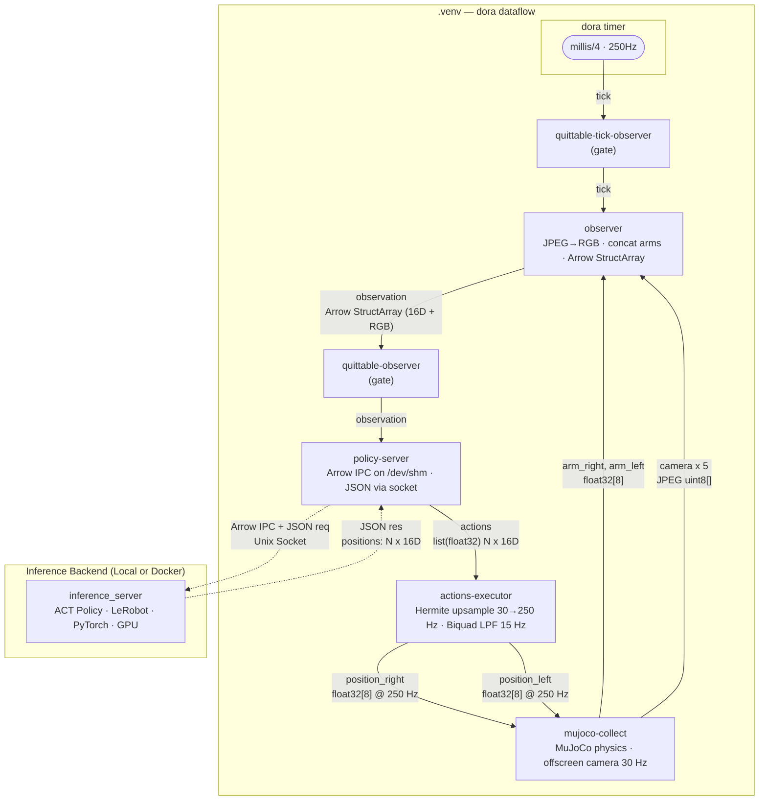

# dora-openarm-inference-lerobot

Real-time bimanual robot control using a pre-trained ACT (Action Chunking with Transformers) policy from [LeRobot](https://github.com/huggingface/lerobot), orchestrated via [dora-rs](https://github.com/dora-rs/dora) dataflow and simulated in [MuJoCo](https://mujoco.org/).

Two deployment modes are available: **Local** (separate process on the host) and **Docker** (isolated container with GPU passthrough).

## Overview

This system runs inference on an [OpenArm](https://openarm.dev/) bimanual robot (dual 7-DOF arms + grippers) using a transformer-based policy trained with LeRobot. The pipeline accepts camera observations and arm state, infers action chunks, and executes them on the robot or its MuJoCo simulation.

## Dataset and model

* Dataset : https://huggingface.co/datasets/k1000dai/openarm_mujoco_pick_cube_3_cam
* Model : https://huggingface.co/k1000dai/act_openarm_pick_cube_40k

## Model Training

Install lerobot==0.3.3 and run the following command to train the ACT policy on the dataset. The trained model will be saved to `outputs/train` and can be optionally pushed to Hugging Face Hub.

```bash
lerobot-train \
  --dataset.repo_id=k1000dai/openarm_mujoco_pick_cube_3_cam \
  --policy.type=act \
  --output_dir=outputs/train \
  --policy.device=cuda \
  --wandb.enable=false \
  --policy.repo_id=k1000dai/act_policy \
  --policy.push_to_hub False
```

## Dataflow Architecture



| Segment | Rate | Note |
|---|---|---|
| timer → observer | 250 Hz | `dora/timer/millis/4` |
| observer → policy-server | ~30 Hz | tick fires after all sensors ready |
| ACT policy inference | ~30 Hz | returns N-step action chunk |
| actions-executor → mujoco | 250 Hz | Hermite spline interpolation |
| camera rendering | 30 Hz | MuJoCo offscreen → JPEG |

## Key Components

| Component | Description |
|---|---|
| **inference_server** (`src/inference_server.py`) | Local mode: loads ACT policy and serves inference via Unix domain socket (bind/listen) |
| **docker_inference_server** (`src/docker_inference_server.py`) | Docker mode: same inference logic, connects to the socket provided by the Dora node |
| **dora-openarm-observer** | Aggregates arm state + camera images into Arrow IPC |
| **dora-openarm-local-policy-server** | Bridges dora node to the external local inference server |
| **dora-openarm-docker-policy-server** | Bridges dora node to a Docker-based inference server (auto-launches container) |
| **dora-openarm-actions-executor** | Upsamples action chunks (Hermite spline) and applies low-pass filter (biquad Butterworth, 15 Hz cutoff) |
| **dora-openarm-mujoco** | MuJoCo physics simulation for the OpenArm robot |

## Prerequisites

- Python 3.10+
- [uv](https://docs.astral.sh/uv/)
- CUDA-capable GPU (falls back to CPU/MPS)
- Docker with NVIDIA Container Toolkit (Docker mode only)

## Setup & Usage

### Option A: Local Mode

The inference server runs as a separate host process. Two virtual environments are used due to CUDA version requirements.

| Environment | Purpose |
|---|---|
| `.venv` | dora dataflow orchestration |
| `.venv_server` | Policy inference server |

**Install:**

```bash
git clone --recursive https://github.com/k1000dai/dora-openarm-inference-lerobot.git
cd dora-openarm-inference-lerobot

# Dataflow environment
uv venv .venv
source .venv/bin/activate
uv pip install dora-rs-cli
deactivate

# Inference server environment
uv venv .venv_server
source .venv_server/bin/activate
uv pip install lerobot==0.3.3 pyarrow Pillow
uv pip install torch torchvision torchaudio --torch-backend=cu128 --upgrade
deactivate
```

**Run:**

```bash
# Terminal 1 — start inference server
source .venv_server/bin/activate
python src/inference_server.py /dev/shm/policy-server.socket

# Terminal 2 — start dora dataflow
source .venv/bin/activate
dora build dataflow-inference.yaml --uv
SOCKET=/dev/shm/policy-server.socket dora run dataflow-inference.yaml --uv
```

### Option B: Docker Mode

The inference server runs inside a Docker container, auto-launched by `dora-openarm-docker-policy-server`. No separate server process is needed.

**Build:**

```bash
docker build --tag dora-openarm-inference-lerobot:latest .
```

**Run:**

```bash
source .venv/bin/activate
dora build dataflow-docker-inference.yaml --uv
dora run dataflow-docker-inference.yaml --uv
```

The Docker container runs with `--gpus=all` and `--network=none` (for security). All model weights (ACT policy + ResNet18 backbone) are pre-downloaded during `docker build`, so no network access is needed at runtime.

### Local vs Docker

| | Local | Docker |
|---|---|---|
| Dataflow | `dataflow-inference.yaml` | `dataflow-docker-inference.yaml` |
| Inference server | `src/inference_server.py` (manual start) | `src/docker_inference_server.py` (auto-launched) |
| Dora policy node | `dora-openarm-local-policy-server` | `dora-openarm-docker-policy-server` |
| Socket | Server binds, client connects | Dora node binds, container connects |
| GPU | Direct host access | `--gpus=all` passthrough |
| Network | Host network | `--network=none` (isolated) |
| Setup | Two venvs | Single venv + Docker image |

## Project Structure

```
├── dataflow-inference.yaml        # Dora dataflow (local mode)
├── dataflow-docker-inference.yaml # Dora dataflow (Docker mode)
├── Dockerfile                     # Docker image for inference server
├── .dockerignore
├── src/
│   ├── inference_server.py        # Local inference server (bind/listen)
│   └── docker_inference_server.py # Docker inference server (connect)
├── nodes/                         # Dora nodes (git submodules)
│   ├── dora-openarm-observer/
│   ├── dora-openarm-local-policy-server/
│   ├── dora-openarm-actions-executor/
│   ├── dora-openarm-mujoco/
│   └── dora-openarm-quitter/
├── pyproject.toml
└── main.py
```
