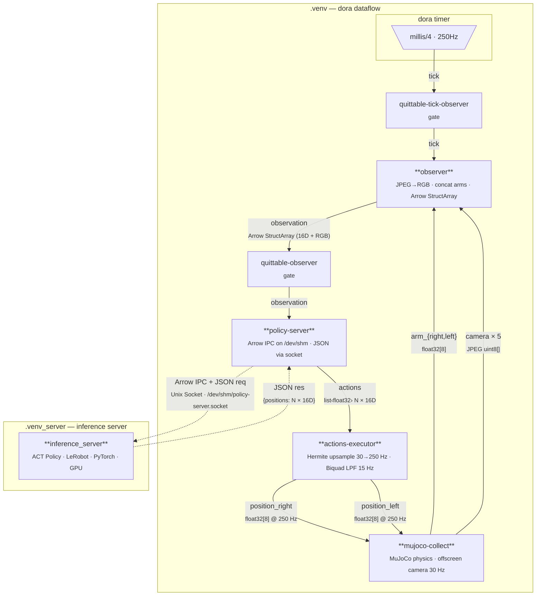

# dora-openarm-inference-lerobot

Real-time bimanual robot control using a pre-trained ACT (Action Chunking with Transformers) policy from [LeRobot](https://github.com/huggingface/lerobot), orchestrated via [dora-rs](https://github.com/dora-rs/dora) dataflow and simulated in [MuJoCo](https://mujoco.org/).

## Overview

This system runs inference on an [OpenArm](https://openarm.dev/) bimanual robot (dual 7-DOF arms + grippers) using a transformer-based policy trained with LeRobot. The pipeline accepts camera observations and arm state, infers action chunks, and executes them on the robot or its MuJoCo simulation.

## Dataset and model

* Dataset : https://huggingface.co/datasets/k1000dai/openarm_mujoco_pick_cube_3_cam
* Model : https://huggingface.co/k1000dai/act_openarm_pick_cube_40k

## Model Training 

install lerobot==0.3.3 and run the following command to train the ACT policy on the dataset. The trained model will be saved to `outputs/train` and can be optionally pushed to Hugging Face Hub.

```python
lerobot-train \
  --dataset.repo_id=k1000dai/openarm_mujoco_pick_cube_3_cam \
  --policy.type=act \
  --output_dir=outputs/train \
  --policy.device=cuda \
  --wandb.enable=false \
  --policy.repo_id=k1000dai/act_policy \
  --policy.push_to_hub False
```

## Dataflow Architecture



| Segment | Rate | Note |
|---|---|---|
| timer → observer | 250 Hz | `dora/timer/millis/4` |
| observer → policy-server | ~30 Hz | tick fires after all sensors ready |
| ACT policy inference | ~30 Hz | returns N-step action chunk |
| actions-executor → mujoco | 250 Hz | Hermite spline interpolation |
| camera rendering | 30 Hz | MuJoCo offscreen → JPEG |

## Key Components

| Component | Description |
|---|---|
| **inference_server** (`src/inference_server.py`) | Loads ACT policy (`k1000dai/act_openarm_pick_cube_40k`) and serves inference via Unix domain socket |
| **dora-openarm-observer** | Aggregates arm state + camera images into Arrow IPC |
| **dora-openarm-local-policy-server** | Bridges dora node to the external inference server |
| **dora-openarm-actions-executor** | Upsamples action chunks (Hermite spline) and applies low-pass filter (biquad Butterworth, 15 Hz cutoff) |
| **dora-openarm-mujoco** | MuJoCo physics simulation for the OpenArm robot |


## Prerequisites

- Python 3.10+
- [uv](https://docs.astral.sh/uv/)
- CUDA-capable GPU (falls back to CPU/MPS)

Two separate virtual environments are used due to CUDA version requirements:

| Environment | Purpose |
|---|---|
| `.venv` | dora dataflow orchestration |
| `.venv_server` | Policy inference server | 

## Setup

```bash
# Clone with submodules
git clone --recursive https://github.com/k1000dai/dora-openarm-inference-lerobot.git
cd dora-openarm-inference-lerobot

# Install dependencies
uv venv .venv
source .venv/bin/activate
uv pip install dora-rs-cli
deactivate
uv venv .venv_server 
source .venv_server/bin/activate
uv pip install lerobot==0.3.3 pyarrow Pillow
# NVIDIA / CUDA 12.8 系を使いたい場合
uv pip install torch torchvision torchaudio --torch-backend=cu128 --upgrade
deactivate
```

## Usage

### policy inference server
```bash
source .venv_server/bin/activate
python src/inference_server.py /dev/shm/policy-server.socket
```

The inference server runs as a separate process, communicating via a Unix domain socket at `/dev/shm/policy-server.socket`.

### dora dataflow
```bash
source .venv/bin/activate
dora build dataflow-inference.yaml --uv
SOCKET=/dev/shm/policy-server.socket dora run dataflow-inference.yaml --uv
```

## Project Structure

```
├── dataflow-inference.yaml        # Dora dataflow graph definition
├── src/
│   └── inference_server.py        # ACT policy inference server
├── nodes/                         # Dora nodes (git submodules)
│   ├── dora-openarm-observer/
│   ├── dora-openarm-local-policy-server/
│   ├── dora-openarm-actions-executor/
│   ├── dora-openarm-mujoco/
│   └── dora-openarm-quitter/
├── pyproject.toml
└── main.py
```
